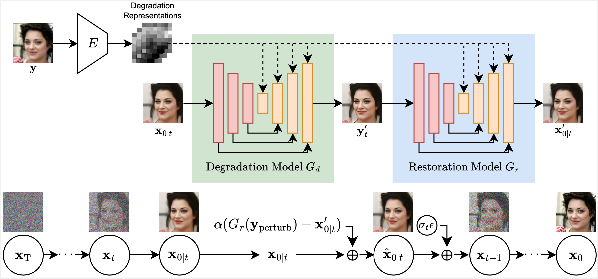
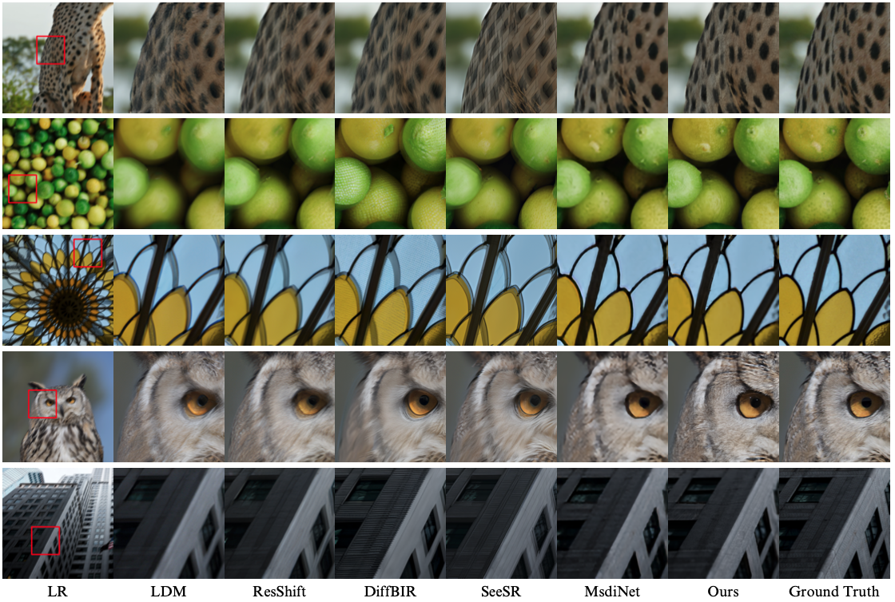
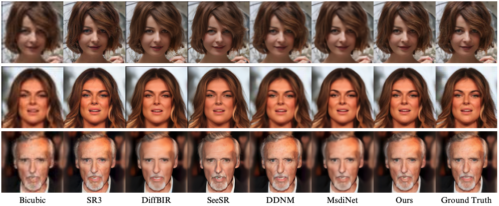
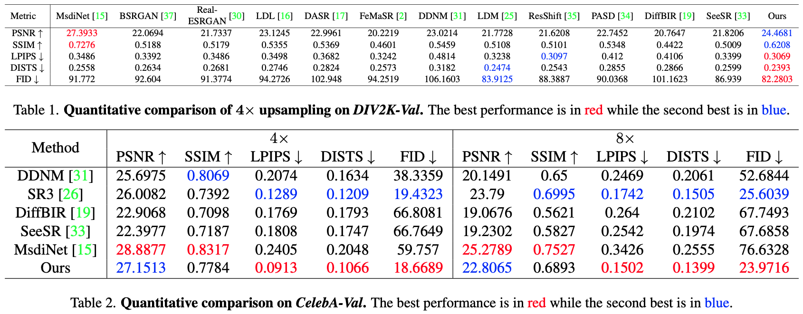

# DADiff: Boosting Diffusion Guidance via Learning Degradation Aware Models for Blind Super Resolution (WACV 2025 Oral)

[Shao-Hao Lu](https://www.linkedin.com/in/shao-hao-lu-b629692a8/), [Ren Wang](https://renwang0508.github.io/), [Ching-Chun Huang](https://nycu-acm.github.io/ACM_NYCU_website/members/Ching-Chun-Huang.html), [Wei-Chen Chiu](https://walonchiu.github.io/)


[Paper](https://arxiv.org/abs/2501.08819) | [Supplementary](assets/0265_supp.pdf) | [Video](https://www.youtube.com/watch?v=ZOUJ0QiSnRc&feature=youtu.be)

:tada: Accepted to **WACV'25** Algorithm Track :tada:

This is the **official repository** of the [**paper**](https://arxiv.org/abs/2501.08819) "Boosting Diffusion Guidance via Learning Degradation Aware Models for Blind Super Resolution".


## Overview
>Recently, diffusion-based blind super-resolution (SR) methods have shown great ability to generate high-resolution images with abundant high-frequency detail, but the detail is often achieved at the expense of fidelity. Meanwhile, another line of research focusing on rectifying the reverse process of diffusion models (i.e., diffusion guidance), has demonstrated the power to generate high-fidelity results for non-blind SR. However, these methods rely on known degradation kernels, making them difficult to apply to blind SR. To address these issues, we present DADiff in this paper. DADiff incorporates degradation-aware models into the diffusion guidance framework, eliminating the need to know degradation kernels. Additionally, we propose two novel techniques---input perturbation and guidance scalar---to further improve our performance. Extensive experimental results show that our proposed method has superior performance over state-of-the-art methods on blind SR benchmarks.
>

## Results
Our full results can be found [here](https://drive.google.com/file/d/1doevxFAxqQfmlY5Y2vIIJFMVh5Cb5RuI/view?usp=sharing).

### Qualitative comparision
<p align="center">

Qualitative comparison of 4× upsampling on DIV2K-Val.
</p>

<p align="center">

Qualitative comparison of 4× upsampling on CelebA-Val.
</p>

### Quantitative comparison
<p align="center">

</p>

The experimental results demonstrate that
1. Compared to DDNM, our method outperforms DDNM in both fidelity and perceptual quality, showing the effectiveness of our degradation-aware models.
2. Compared to diffusion-based blind super-resolution methods, we also excel in both fidelity and perceptual quality, where the improvements in fidelity should be attributed to applying diffusion guidance.
3. Compared to MsdiNet, which is exactly our restoration model Gr, our method demonstrates superior perceptual quality, but at the expense of fidelity because MsdiNet is a regression-based method.


## Installation
### Code
```
git clone https://github.com/ryanlu2240/DADiff.git
```
### Environment
```
conda env create -f environment.yml
conda activate DADiff
```
### Pre-Trained Models
To restore general images,
1. Download our degradation-aware model [div2k_x4](https://drive.google.com/file/d/1aKVfQlx6MbgLtJarTg4eBv9SlAhiXssJ/view?usp=sharing). 
2. Also download this [diffusion model](https://drive.google.com/file/d/1ToiNqyDnxj9r6hrpd5J43QuBC7G1NP4O/view?usp=sharing) (from [guided-diffusion](https://github.com/openai/guided-diffusion)).

To restore human face images,
1. Download our degradation-aware models [celeba_x4](https://drive.google.com/file/d/1WF_cvSrIY7ltSYQoqK5JK1zvAyAhBVwX/view?usp=sharing) and [celeba_x8](https://drive.google.com/file/d/13oUxCWDKLRLDu7O1kci4WaW7e2y-WX6w/view?usp=sharing).
2. Also download this [diffusion model](https://drive.google.com/file/d/1_V4wIVciyPayyzBs3H5IchegAt9W8Jks/view?usp=sharing) (from [SDEdit](https://github.com/ermongroup/SDEdit)).


### Test Datasets
To reproduce our results in the paper, download our [test datasets](https://drive.google.com/file/d/12t60HfSwosHxZMhk_aulveMfp79Gg7QQ/view?usp=sharing).


## Running
### Quick Start
Run the command below to get 4x SR results immediately. The results should be in `DADiff/exp/result/`.
```
bash run_celeba_x4.sh
```
Also check `run_celeba_x8.sh` and `run_div2k_blind_x4.sh`.
### Command
The command in the shell scripts is organized as:
```
python main.py --simplified --eta {ETA} --config {diffusion_CONFIG} --dataset celeba --deg_scale {DEGRADATION_SCALE} --alpha {GUIDANCE_SCALAR} --total_step 100 --mode implicit --DDNM_A implicit --DDNM_Ap implicit --posterior_formula DDIM --perturb_y --perturb_A implicit --perturb_Ap implicit --Learning_degradation --IRopt {Degradation-Aware_CONFIG} --image_folder {IMAGE_FOLDER} --path_y {INPUT_PATH} --diffusion_ckpt {DIFFUSION_CKPT} --save_img
```
The options are defined as:
- `INPUT_PATH`: the root folder of input image.
- `ETA`: the DDIM hyperparameter.
- `DEGRADATION_SCALE`: the scale of degredation.
- `diffusion_CONFIG`: the name of the diffusion model config file.
- `GUIDANCE_SCALAR`: the proposed guidance scalar.
- `DIFFUSION_CKPT`: the path of pretrain diffusion checkpoint.
- `IMAGE_FOLDER`: the folder name of the results.
- `Degradation-Aware_CONFIG`: the MsdiNet config file, including the degradation-aware model checkpoint setting.


## Reference
If you find this work useful to your research, please cite our paper by:
```
@inproceedings{lu2025dadiff,
  title={Boosting Diffusion Guidance via Learning Degradation-Aware Models for Blind Super Resolution},
  author={Lu, Shao-Hao and Wang, Ren and Huang, Ching-Chun and Chiu, Wei-Chen},
  booktitle={IEEE/CVF Winter Conference on Applications of Computer Vision},
  year={2025}
}
```
## Acknowledgement

This work is built upon the the gaint sholder of [DDNM](https://github.com/wyhuai/DDNM/) and [MsdiNet](https://github.com/dasongli1/Learning_degradation). Great thanks to them!


